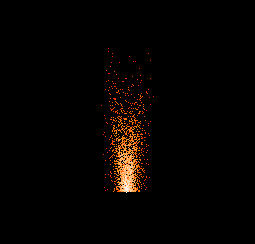

# Particle-OpenGL-in-C
Particle systems will be based as a type of point particles (Point Particles).
Textures will be added in the future.

## Particles
 - [ ] Fire Effects
   - [x] Bonfire 
   - [ ] Fireworks
   - [ ] Explosions
 - [x] Coming soon ...  

## Introduction
The project is intended to show a system of particles of various types. 
The main idea is to learn OpenGL in C and present how particles work in a simple way.

Used libraries
1. [GLM for C](https://github.com/recp/cglm) 
2. [GLFW](https://www.glfw.org/)
3. [GLAD](https://glad.dav1d.de/)

## Samples

**Bonfire**

## Features

- [ ] Separate Particle and Particle System
- [ ] Add Physics
- [ ] Add Texture